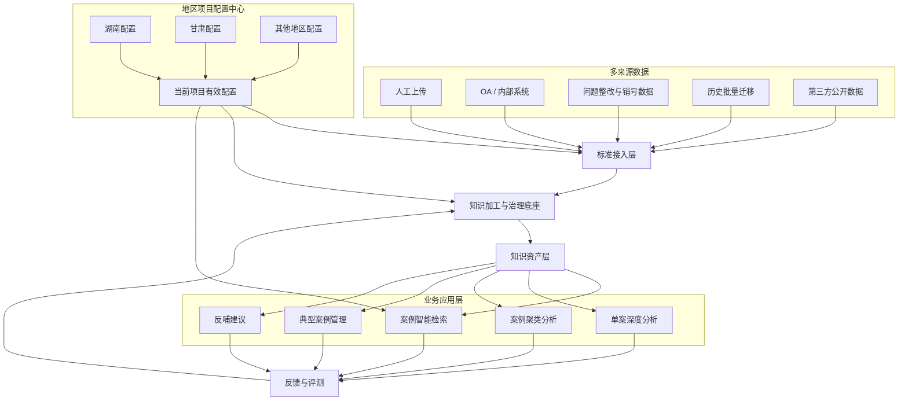
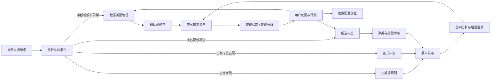

# 案例知识底座与智能应用标准产品方案

## 一、先看结论：这套产品要解决什么

本方案建设的不是一个只服务湖南文书检索的单点工具，也不是一次性把所有地区做成完全相同的系统，而是形成一套“**通用知识底座 + 地区独立配置 + 按需业务应用**”的标准产品。

它要完成一条稳定闭环：

```text
多来源数据进入
→ 统一接入和留痕
→ 解析、切块、字段标准化
→ 数据质量和标签治理
→ 形成可检索、可分析的知识资产
→ 智能检索和业务分析
→ 用户反馈回到治理和评测
→ 规则、标签和检索效果持续迭代
```

第一阶段重点是把底层数据和治理链路做稳。湖南先验证“文书入库—治理—检索”，甘肃先验证“多来源案例—聚类分析—典型案例—反哺建议”。Agent、全自动规则学习、复杂跨库研究等能力放到后续，不进入最小 MVP。

## 二、产品定位：一套底座，多套地区方案

### 2.1 总体模式



### 2.2 什么共用，什么隔离

| 内容 | 是否共用 | 说明 |
|---|---|---|
| 文件接入、任务调度、解析、去重、审计 | 共用 | 属于标准底座能力 |
| 数据质量、元数据、标签、版本、反馈机制 | 共用产品能力 | 页面和流程共用，具体数据隔离 |
| 元数据字段、标签目录、Prompt、切块策略 | 地区隔离 | 湖南和甘肃各有独立配置及版本 |
| 知识库、检索阈值、评测集 | 地区隔离 | 避免一个地区的调整影响另一个地区 |
| 业务菜单和应用 | 按需启用 | 湖南偏文书检索，甘肃偏案例治理与分析 |

统一使用 `project_id` 标识地区或项目，例如：

- `hunan_case_library`：湖南历史案例文书库。
- `gansu_case_library`：甘肃一般案例及典型案例库。

所有文件、任务、元数据、标签、知识索引和评测结果都必须携带 `project_id`，不允许跨项目自动回退或混用。

## 三、不同数据来源如何进入同一套体系

### 3.1 统一接入模型

无论数据来自哪里，先转成统一的“入库任务”，至少保留：

- 项目、来源类型、来源系统。
- 原始记录 ID、文件 ID 或网页地址。
- 原始文件、结构化正文或字段数据。
- 接入时间、数据版本、文件摘要值。
- 数据权限、保密级别和原始责任主体。

统一只是统一处理入口，不意味着抹掉来源差异。后续页面仍可以追溯数据来自 OA、人工上传、甘肃问题库或第三方网站。

### 3.2 各类来源的处理方式

| 来源 | 典型数据 | 接入方式 | MVP 建议 | 后续完善 |
|---|---|---|---|---|
| 人工上传 | Word、PDF、Excel、扫描件 | 页面上传后创建入库任务 | 湖南、甘肃都支持 | 批量上传、模板校验、断点续传 |
| OA / 内部公文系统 | 正文、文号、附件、流程信息 | API、消息或定时同步 | 湖南优先接入 | 增量同步、撤回及版本联动 |
| 内部业务系统 | 甘肃问题整改、审核、销号记录 | API、数据库视图或批量交换文件 | 甘肃优先接入一种稳定方式 | 实时事件、跨系统状态联动 |
| 历史数据迁移 | 历史文档包、Excel 台账 | 批量导入任务 | MVP 支持小批量验证 | 专项迁移工具和差异报告 |
| 第三方公开数据 | 网站公开案例、政策、处罚文书 | 合规爬取或人工导入 | MVP 先用人工导入替代爬虫 | 来源白名单、更新监测、失效链接检测 |

第三方爬取不应在第一期直接做成通用爬虫。先验证“外部公开文件进入标准治理链路”是否成立，再根据明确的网站范围、授权和更新频率建设采集器。

## 四、模块如何形成闭环



闭环中有三个原则：

1. 正常数据自动通过，只把异常送给用户，避免逐条审核。
2. LLM 可以提取、推荐和解释，但不能直接修改正式元数据规则或正式标签。
3. 用户反馈先形成可追溯的质量任务、标签候选或评测样本，不直接让生产规则“自我修改”。

## 五、分模块产品设计

### 5.1 案例入库管理

**使用人：** 数据维护人员、业务填报人员、系统管理员。

**解决问题：** 数据从哪里来、处理到哪一步、为什么失败、能否重试和追溯。

核心能力：

- 查看 OA 同步、内部系统接入、人工上传和批量迁移任务。
- 自主上传 OA 之外的 Word、PDF、Excel 等文件。
- 展示接收、解析、抽取、治理、入库各阶段状态。
- 异常任务支持重试、补充信息或转数据质量管理。
- 原始文件与知识库索引分开保存，始终能够追溯来源。

### 5.2 数据质量管理

**使用人：** 数据管理员、业务专家。

**解决问题：** 缺失、格式错误、字段冲突、疑似重复、解析失败、低置信度等少量异常。

核心能力：

- 只处理异常，不审核全部文档。
- 展示当前值、系统建议、原文依据和影响范围。
- 支持批量采用相同修正、忽略、重新检测和合并重复数据。
- 把“字段质量问题”和“候选新标签”分开处理。

### 5.3 元数据管理

**使用人：** 知识库管理员、业务规则负责人。

**解决问题：** 系统要管理哪些字段、字段如何提取和校验、变更后影响哪些数据。

元数据值分三种模式：

| 模式 | 示例 | 系统处理 |
|---|---|---|
| 固定枚举 | 行政区划、文书类型、监督领域 | 与编码、正式名称、别名匹配；未匹配进入异常，不自动新增 |
| 可扩充分类 | 违规类型、问题领域、处理方式 | 先匹配正式标签，未匹配生成候选标签 |
| 开放值 | 标题、文号、单位、日期 | 依据原文抽取、格式化、去重，一般不形成标签目录 |

字段新增、语义变化或取值模式变化必须生成新版本。发布前展示影响文档数量；发布后只回填受影响字段，而不是重新处理全部内容。

### 5.4 智能标签管理

**使用人：** 业务专家、标签管理员。

**解决问题：** 标签如何持续新增、合并、改名、停用，同时避免标签泛滥。

标签生命周期：

```text
正式标签 ← 批准候选
正式标签 ← 候选并入已有标签 / 登记为别名
正式标签 → 改名 / 合并 / 停用（保留历史映射）
候选标签 → 待观察 / 驳回
```

降低人工工作量的方式：

- 高置信度匹配自动通过。
- 相似候选先聚类，再由用户批量审核。
- 低频低风险候选进入观察池，不实时打扰用户。
- 触发审核不设固定“满 20 条”门槛，综合重复频次、风险、置信度、时间和用户反馈排序。
- 改名、合并和停用都保留旧值映射，避免历史检索失效。

### 5.5 案例智能检索

**使用人：** 监督检查人员、业务管理人员、研究分析人员。

标准检索链路：

```text
查询意图识别
→ 元数据条件过滤
→ 关键词 + 向量混合召回
→ Rerank 重排
→ 按文档聚合和去重
→ 质量阈值过滤
→ 展示相关度、命中片段和匹配原因
```

要求：

- 排序分不能直接显示为准确率百分比，可转成“高 / 中 / 较弱相关”或仅用于排序。
- `hit_chunks` 是检索真正命中的证据片段，用于解释“为什么返回该案例”，不是全文替代品。
- 每条结果最多展示 1—3 个最有代表性的片段，突出查询词及语义命中点。
- 深度分析只在用户点击某一条结果后调用，不对全部结果自动调用 LLM。

### 5.6 案例分析与成果沉淀

**使用人：** 甘肃业务管理人员、监督负责人、典型案例审核人员。

适合甘肃优先建设：

- 从已入库一般案例识别共性问题和重复风险。
- 关联问题整改、审核、销号及佐证材料，判断闭环情况。
- 从共性问题申请典型案例，经审核后形成正式成果。
- 从典型案例提炼政策建议、规则建议和问题整改建议。
- 检索反哺建议，并能回看建议来源案例和原始依据。

这些能力建立在治理后的案例资产之上，不应直接绕过数据质量和标签标准对原始业务表做一次性分析。

### 5.7 反馈与智能优化

**使用人：** 普通检索用户、业务专家、产品运营人员。

第一阶段只需要收集最有价值的反馈：

- 结果是否相关。
- 命中片段是否能解释检索原因。
- 标签或元数据是否错误。
- 深度分析结论是否有用、依据是否充分。

反馈分流：

| 反馈 | 去向 |
|---|---|
| 字段错误、正文错误、重复文档 | 数据质量任务 |
| 标签错误、缺少新分类 | 标签候选或标签修正任务 |
| 搜不到、排序差、无关结果 | 检索评测集和检索配置优化 |
| 分析结论错误、证据不足 | 深度分析 Prompt 和评测集 |

真正的“智能自优化”是：积累有标签的反馈样本，经过评测后发布新版本，而不是让模型直接修改线上规则。

## 六、湖南与甘肃分别启用什么

### 6.1 能力矩阵

| 能力 | 通用底座 | 湖南当前优先 | 甘肃当前优先 | 后续 |
|---|---|---|---|---|
| 人工上传、任务追踪 | 共用 | 是 | 是 | 批量及断点续传 |
| OA 文书同步 | 标准连接器 | 是 | 按数据来源决定 | 多系统增量同步 |
| 业务系统数据接入 | 标准连接器 | 暂不优先 | 问题整改、销号数据优先 | 实时状态联动 |
| 数据质量管理 | 共用框架 | 是 | 是，但异常类型不同 | 自动修复规则库 |
| 元数据管理 | 共用框架 | 文书字段体系 | 案例及问题字段体系 | 跨版本影响分析 |
| 智能标签管理 | 共用框架 | 违规类型、问题领域等 | 案例标签、领域、共性问题等 | 标签图谱与跨库映射 |
| 案例智能检索 | 共用引擎 | 历史文书检索 | 一般案例检索 | 跨库联合检索 |
| 单案深度分析 | 共用按需能力 | 第二阶段 | 可与案例分析联动 | 多证据综合分析 |
| 聚类与典型案例 | 可选应用 | 暂不优先 | 优先 | 跨年度、跨地区分析 |
| 反哺建议 | 可选应用 | 暂不优先 | 优先 | 建议采纳及成效跟踪 |

### 6.2 湖南第一阶段菜单

```text
湖南案例库
├── 案例入库管理
├── 数据质量管理
├── 元数据管理
├── 智能标签管理
└── 案例智能检索
```

湖南第一阶段以 OA 文书和人工上传文件为主，先把真实入库、元数据筛选、可解释检索打通。单案深度分析、认定标准分类和历史批量回填随后增加。

当前原型参考：

- [湖南案例库页面规格](../prototypes/hunan-case-library/spec.md)
- [湖南案例知识治理 MVP 方案](湖南案例知识治理MVP落地方案.md)

### 6.3 甘肃业务菜单

```text
甘肃案例库
├── 智能检索
│   ├── 案例智能检索
│   └── 反哺建议检索
├── 一般案例管理
├── 案例聚类分析
├── 典型案例管理
│   ├── 申请
│   └── 审核
├── 案例采集管理
└── 案例标签管理
```

甘肃的案例来源不仅是文书，还包括问题整改和销号数据、上级下发、外部公开案例等。通用底座负责接入和治理；一般案例管理负责业务确认；聚类、典型案例和反哺建议负责进一步加工成果。

当前原型参考：

- [甘肃案例库总体规格](../prototypes/case-library-ai/spec.md)
- [甘肃案例智能检索规格](../prototypes/gansu-case-search/spec.md)
- [甘肃反哺建议检索规格](../prototypes/gansu-feedback-suggestion-search/spec.md)

## 七、Workflow、LLM 与代码如何分工

### 7.1 推荐原则

| 方式 | 适合做什么 | 不适合做什么 |
|---|---|---|
| Dify Workflow | 快速验证抽取、分类、检索、按需深度分析和 Prompt | 长期保存正式标签、复杂批任务、权限、审计和高并发控制 |
| LLM | 非结构化信息抽取、候选标签推荐、语义解释、分析摘要 | 决定正式规则、直接发布标签、唯一负责格式和幂等校验 |
| 代码服务 | 来源连接、文件处理、确定性校验、去重、版本、任务、权限、审计、回填 | 频繁变化且需快速试验的 Prompt 逻辑 |
| 数据库 / 对象存储 / 索引 | 正式规则、标签、反馈、任务、原始文件、知识索引 | 临时用 Prompt 代替持久化治理数据 |

### 7.2 建议的 Workflow

| Workflow | 触发方式 | 主要职责 | 阶段 |
|---|---|---|---|
| 入库抽取与治理 Workflow | 每个新任务 | 解析结果接收、LLM 抽取、标签推荐、依据输出 | MVP |
| 案例智能检索 Workflow | 用户检索 | Hybrid 召回、Rerank、结果聚合与解释 | MVP |
| 单案深度分析 Workflow | 用户点击单条结果 | 为什么相似、共同问题、差异、参考价值、证据 | 第二阶段 |
| 共性问题分析 Workflow | 人工发起或批次任务 | 对限定范围案例做聚类、命名和代表性解释 | 甘肃第二阶段 |
| 认定标准分类 Workflow | 单案或批次任务 | 检索适用标准并输出分类及原始依据 | 后续 |

候选标签审核本质上是业务页面和数据状态流转，不必为每次审核单独启动 Workflow。候选聚类、相似标签推荐可由定时或人工触发的分析任务辅助。

历史回填在 MVP 中可以用批量 Workflow 验证；生产系统应改成代码任务服务，支持影响分析、队列、断点续跑、失败重试和审计。

### 7.3 是否需要 Agent

MVP 不需要 Agent。当前任务路径稳定，Workflow 更可控、更易评测。

只有出现以下问题时再引入 Agent：

- 需要跨案例库、标准库、政策库和外部数据反复检索。
- 需要根据中间证据动态选择下一步工具。
- 需要自动改写查询、多轮验证并形成综合研究报告。
- 需要把一个复杂业务问题拆成多个子任务并检查证据完整性。

未来 Agent 应调用现有入库、检索、深度分析和标准分类 Workflow，不替代这些稳定底座。

## 八、切块策略：不是统一按段落切

### 8.1 不同数据采用不同知识单元

| 数据形态 | 推荐知识单元 | 关键要求 |
|---|---|---|
| 案例、公文、报告 | 标题、事实、处理意见、整改要求、政策依据等语义段 | 保留章节、页码、前后关系 |
| Excel 认定标准 | 一条标准或一行业务记录 | 保留 Sheet、行号、列名和层级表头 |
| 问题整改 / 销号记录 | 一个问题及其整改闭环对象 | 关联整改、审核、销号和附件，不按文字长度硬切 |
| 网页公开案例 | 标题、正文分节、来源信息 | 清除导航、广告、版权等噪声 |
| 扫描件 | 页码 + OCR 段落 + 版面区块 | 保留原页定位和 OCR 置信度 |

### 8.2 第一版策略

- 优先通过解析代码识别标题、段落、表格、页码和业务字段。
- 结构不清或内容混杂时，再由 LLM 辅助判断语义边界，不让 LLM 负责全部切块。
- 过长语义段再按长度拆分；仅在同一章节内保留少量重叠。
- 日期、页眉、页脚、落款等过短内容不能单独成为有效命中片段。
- 每个 chunk 保留稳定的 `document_id`、`chunk_id`、章节、页码/行号和来源位置。
- 检索结果按文档聚合，不让同一文档的多个 chunk 挤占全部 TopK。

长度没有通用最优值。MVP 可以用约 500—1000 个中文字符作为长段拆分起点，再通过固定测试集比较后调整；Excel 和结构化业务记录不使用这个长度规则。

## 九、MVP 怎么落地

### 9.1 第一阶段：标准地基和页面确认

先完成：

1. 统一 `project_id`、来源模型、元数据三种值模式、标签生命周期和版本规则。
2. 保留现有湖南五个治理/检索页面，确认页面职责和操作边界。
3. 保留甘肃现有一般案例、聚类、典型案例、检索和反哺建议页面。
4. 用 Mock 数据完成多来源、异常、候选标签和反馈分流演示。
5. 确认湖南、甘肃各自第一版字段、标签、Prompt 和切块配置。

本阶段不接真实数据库、批量调度、权限和自动爬虫。

### 9.2 第二阶段：最小真实闭环

推荐只接最有代表性的来源：

- 湖南：OA 文书 + 人工上传。
- 甘肃：问题整改 / 销号内部数据 + 人工补充案例。

打通：

```text
真实来源 → 入库任务 → 抽取与治理 → 异常处理 → 知识索引 → 智能检索
```

同时建设轻量 BFF 和治理数据存储，页面不直接调用 Dify，也不在浏览器保存 API Key。

### 9.3 第三阶段：标签迭代和历史回填

- 候选标签聚类、批量审核、别名、合并和停用。
- 元数据与标签版本发布、影响分析和增量回填。
- 检索反馈进入评测集，形成可对比的检索配置版本。
- 新字段只回填相关字段；标签合并只迁移受影响文档。

### 9.4 第四阶段：智能分析和更多来源

- 甘肃共性问题分析、典型案例和反哺建议真实闭环。
- 湖南单案深度分析、认定标准分类。
- 外部公开数据白名单采集。
- 跨年度、跨来源和跨地区对比，但仍保持项目数据权限隔离。

### 9.5 第五阶段：生产化和可选 Agent

- 将稳定的任务调度、回填、权限、审计和高并发能力改为代码服务。
- Dify 继续用于 Prompt 和模型流程试验，或逐步替换为自研编排。
- 在已有 Workflow、工具和评测集稳定后，再增加复杂研究型 Agent。

## 十、哪些先不做

MVP 暂不建设：

- 通用互联网爬虫平台。
- 自动批准所有新标签或自动修改正式元数据规则。
- 全量历史数据一次性回填。
- 跨所有地区统一一套业务标签。
- 复杂多级权限、生产级审计中心和实时流式同步。
- 面向复杂研究任务的 Agent。
- 没有业务口径支撑的风险评分、趋势预测和自动决策。

这些能力需要在真实数据、治理流程和评测基线稳定后分批补充。

## 十一、测试和持续迭代

### 11.1 每个地区建立独立评测集

MVP 每个地区先选：

- 30—50 条有代表性的数据。
- 30—50 个真实业务查询。
- 明确每个查询应命中的案例、可接受结果和不相关结果。
- 覆盖精确文号、业务关键词、自然语言问题、元数据筛选和应当无结果的查询。

### 11.2 重点指标

| 环节 | 重点观察 |
|---|---|
| 入库 | 解析成功率、字段完整率、字段准确率、重复识别率 |
| 治理 | 自动通过率、异常率、人工平均处理时间、候选标签合并率 |
| 检索 | Top3 / Top5 命中率、无关结果率、无结果率、重复结果率、响应时间 |
| 片段 | 命中片段是否完整、是否能解释结果、是否出现孤立日期或页眉 |
| 分析 | 结论正确性、依据可追溯性、用户采纳率 |

### 11.3 版本化迭代

每次调整记录独立版本：

- `metadata_rule_version`
- `tag_version`
- `chunk_profile_version`
- `retrieval_profile_version`
- `prompt_version`

固定评测集上，新版本明显优于旧版本后再发布。相关度阈值不能只看一次查询的原始 score，也不能把湖南阈值直接复制给甘肃；应结合各地区真实正负样本确定。

## 十二、当前执行顺序

1. **先确认标准方案**：确认通用底座、地区隔离、模块职责和分期边界。
2. **冻结两地 MVP 配置**：分别确认湖南、甘肃的来源、字段、标签、Prompt 和第一版切块策略。
3. **补齐页面原型状态**：重点补多来源接入、异常分流、候选标签、反馈分流和甘肃销号来源展示。
4. **选择真实闭环样本**：湖南选 OA 文书，甘肃选问题整改 / 销号数据，各跑通一条链路。
5. **建立评测集再调参数**：先有基线，再优化切块、Hybrid 权重、Rerank 和阈值。
6. **根据结果决定第二阶段**：优先做历史回填、单案深度分析或甘肃共性问题分析，不同时铺开。

这个顺序保证第一期既能形成可演示产品，又不会把尚未验证的自动治理、爬虫和 Agent 提前做重。
