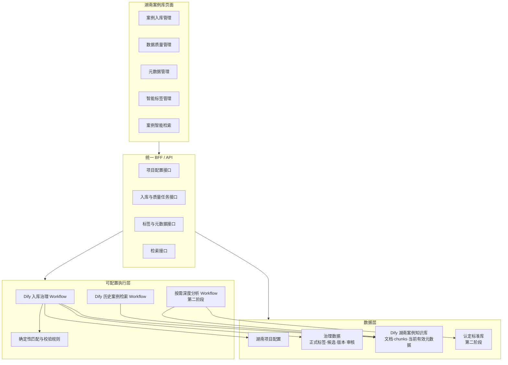
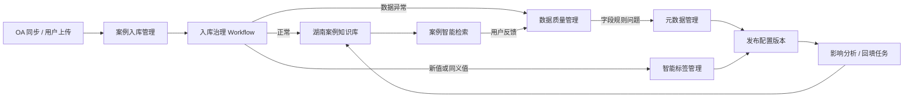
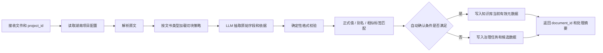

# 湖南案例知识治理 MVP 落地方案

## 一、方案定位

本方案用于把现有“湖南案例库”从单一检索 Demo 扩展为一个可演示的知识治理闭环。第一期重点不是建设完整生产平台，而是证明以下链路能够成立：

1. 湖南项目拥有独立的元数据、标签、Prompt、切块和阈值配置，不影响其他案例库。
2. 新文件进入后，系统能提取字段、匹配正式标签，并把少量异常分别送入数据质量或候选标签队列。
3. OA 文书和用户自主上传文件使用同一套入库治理流程，并能追溯原始来源。
4. 正式结果能够继续被现有案例检索、筛选和后续深度分析使用。

第一期采用“页面调用统一 BFF，BFF 调用 Dify Workflow 和治理数据”的方式。Dify 用于快速配置和验证流程，页面不直接依赖 Dify 的节点结构，后续可逐步替换为代码服务。

## 二、MVP 总体架构



核心隔离键统一使用 `project_id = hunan_case_library`。无论调用 Workflow、读取配置、查询标签还是写入治理任务，都必须携带该标识；不存在湖南配置时直接报错，不自动回退到其他地区配置。

## 三、第一期页面范围

### 3.1 湖南案例库信息架构

```text
湖南案例库
├── 案例入库管理（MVP）
├── 数据质量管理（MVP）
├── 元数据管理（MVP）
├── 智能标签管理（MVP）
└── 案例智能检索（已实现）
```

MVP 菜单按“接入—质量—标准—标签—使用”排列。OA 文书和用户自主上传文件都从案例入库管理进入；异常处理、字段规则和标签目录分别由独立页面承担。原有案例档案、智能分析和典型案例页面不进入本期菜单；认定标准和独立回填页面作为第二阶段能力。

### 3.2 页面一：案例入库管理

#### 页面目标

供业务人员查看 OA 接入文书、上传 OA 之外的文件，并跟踪文件从接收到写入知识库的处理状态。

#### 页面结构

```text
状态页签：全部 / 处理中 / 待处理 / 异常
└── 来源目录：OA 同步 / 用户上传 / 异常任务
    └── 标准工具栏 + 入库任务表格 + 分页
        └── 任务详情抽屉：来源、处理进度、失败原因、重新执行
```

#### 核心交互

- 上传支持 PDF、Word、Excel 的原型演示；同步 OA 与自主上传使用同一处理链路。
- 表格展示来源标识、解析、元数据和入库状态；详情抽屉展示完整处理步骤和异常原因。
- 正常任务自动流转，不要求用户逐条确认；字段异常转数据质量管理，候选标签转智能标签管理。

### 3.3 页面二：数据质量管理

#### 页面目标

供业务专家处理系统无法可靠自动修复的数据缺失、冲突、重复和解析异常，而不是审核全部文件。

#### 页面结构

```text
状态页签：待处理 / 已处理 / 全部
└── 问题分类：元数据缺失 / 字段冲突 / 疑似重复 / 解析异常 / 低置信度
    └── 标准工具栏 + 质量问题表格 + 分页
        └── 处理抽屉：当前值、系统建议、原文依据、判断说明
```

#### 核心交互

- 默认只展示异常，支持采用建议、手工修正、忽略、重新检测和批量处理。
- 相同异常先聚合后处理；高置信度且通过规则的数据不进入人工队列。
- 候选新标签不在此页审核，避免质量问题和标签治理混为一体。

### 3.4 页面三：元数据管理

#### 页面目标

供知识库管理员定义“要管理哪些字段、字段属于哪种值模式、如何校验以及变更会影响什么数据”。

#### 页面结构

```text
状态页签：全部字段 / 已发布 / 草稿
└── 字段分组目录
    └── 标准工具栏 + 元数据字段表格 + 分页
        └── 字段编辑抽屉：定义、值域方式、抽取规则、应用位置
```

#### 三种值模式

| 值模式 | 示例 | 处理方式 | 是否形成标签目录 |
|---|---|---|---|
| 固定枚举 | 行政区划、文书类型、监督领域 | 编码、正式名称、别名精确匹配；未匹配即异常 | 可以，但不允许 LLM 自动新增 |
| 可扩充标签 | 违规类型、问题领域、处理方式 | 先匹配正式标签；无法匹配时生成候选并审核 | 是 |
| 开放值 | 标题、文号、相关单位、日期 | 依据原文抽取、格式化和去重 | 通常不是标签 |

#### 关键配置项

- 字段编码、中文名称、数据类型、单值/多值、是否必填。
- 值模式：固定枚举、可扩充标签、开放值。
- 抽取说明、允许为空条件、格式化规则、原文依据要求。
- 是否参与筛选、检索展示、深度分析和历史回填。
- 自动确认阈值、人工审核条件和高风险标识。
- 当前规则版本、生效时间、创建人和变更说明。

#### 变更规则

- 草稿修改不直接影响现有数据。
- 发布前先做影响分析，展示预计受影响文档数和需要重跑的字段。
- 字段名称调整可只改展示名称；字段语义或取值模式改变必须生成新版本。
- 新增字段后可对历史文档发起增量回填，不要求重新处理所有字段。
- 停用字段保留历史值和版本，不做物理删除。

### 3.5 页面四：智能标签管理

#### 页面目标

供业务专家维护可扩充字段的正式值、层级、别名和生命周期，并集中处理候选标签。

#### 页面结构

```text
状态页签：正式标签 / 候选标签 / 已停用
└── 标签字段目录：违规类型 / 问题领域 / 处理方式 / 文书类型
    └── 标准工具栏 + 标签表格 + 分页
        └── 标签详情或候选审核抽屉
```

#### 正式标签与候选标签

- 正式标签：已审核发布，可用于入库、筛选、检索和统计。
- 候选标签：LLM 或规则从新文档中发现、尚未正式发布的建议值。
- 候选标签不是 Dify 知识库的正式元数据值，不能未经审核直接污染筛选项。
- 一个候选可以批准为新标签、并入现有标签、登记为别名或驳回。
- 标签合并必须生成旧值到新值的迁移关系，并提示受影响文档数量。

#### 降低用户工作量的机制

- 同义候选自动聚类后集中审核。
- 为每个候选展示推荐正式标签和相似理由。
- 支持批量采用、批量合并和一次性发布。
- 低频候选不立即打扰用户，进入待观察池；当重复出现、影响文档增多或被业务用户反馈时提升优先级。
- 系统持续聚合候选，但不使用“必须累计到 20 个才处理”的固定规则；触发条件由频次、风险、置信度和时间共同决定。

## 四、页面之间如何形成闭环



MVP 中 OA 和用户文件统一进入案例入库管理。数据异常进入数据质量管理，标签新值进入智能标签管理；字段或标签规则形成新版本后，必要时回填历史数据。检索和深度分析中的反馈可再次形成质量任务。

## 五、MVP Workflow 设计

### 5.1 Workflow A：湖南案例入库治理

#### 输入

- `project_id`：固定为 `hunan_case_library`。
- `source_type`：案例文书、业务资料等。
- `file` 或文件引用。
- `config_version`：默认读取当前启用版本，也允许指定版本重跑。

#### 节点逻辑



#### Dify 中适合配置的内容

- 文件解析和 LLM 抽取节点。
- 按 `source_type` 或文书类型走不同分支。
- Prompt 模板和结构化输出。
- 调用 BFF 的配置查询、标签匹配、治理任务创建和知识库写入接口。

#### 不建议只在 Dify 中保存的内容

- 正式标签目录、候选标签、别名和合并历史。
- 审核状态、审核人、规则版本和回填记录。
- 生产级权限、并发控制、幂等和审计日志。

这些数据需要可查询、可追溯、可迁移，MVP 至少进入轻量治理数据存储，由 BFF 统一访问。

### 5.2 Workflow B：历史案例智能检索

复用现有 Workflow，并逐步增加：

- 输入 `project_id` 和结构化筛选条件。
- 在召回前应用知识库元数据过滤，而不是只在前端或 TopK 结果后过滤。
- 返回 `document_id`、当前有效元数据、排序分和 `hit_chunks`。
- 对同一文档的多个命中片段进行聚合、去重和异常短片段过滤。
- 排序分只用于候选先后和相关度档位，不作为准确率百分比。

### 5.3 Workflow C：案例深度分析（第二阶段）

只在用户点击单条结果后执行。输入为 `project_id + query + document_id + hit_chunks`，再获取全文和认定标准，输出“为什么相似、共同问题、主要差异、是否值得参考、原始依据”。

### 5.4 回填任务（MVP 与生产化边界）

MVP 可先由元数据管理或智能标签管理在版本发布后创建“待回填任务”，人工点击执行；Dify Workflow 按 document_id 列表批量重跑受影响字段。

正式系统再升级为任务服务：支持队列、断点续跑、失败重试、并发控制、定时执行和完整审计。页面与任务结构保持不变，只替换执行底座。

## 六、项目配置模型

湖南项目至少需要一份独立配置，逻辑结构如下：

```text
hunan_case_library
├── metadata_schema       字段、类型、值模式、抽取和校验要求
├── taxonomies            正式标签、层级、别名、状态和版本
├── prompt_profile        系统提示词和湖南业务提示词
├── chunk_profile         各类文档的切块方式、长度、重叠和位置保留
├── retrieval_profile     TopK、Hybrid 权重、Rerank、阈值和聚合方式
├── review_policy         自动确认、批量审核和人工审核条件
└── standard_profile      认定标准库和适用版本（第二阶段）
```

页面显示的是业务可理解的配置名称和说明；API Key、数据集 ID、Workflow ID 等技术参数只在服务端环境配置中维护，不进入业务页面，也不进入浏览器。

## 七、技术实现要求

### 7.1 统一接口层

页面不直接调用 Dify。BFF 提供稳定业务接口，至少包括：

- 查询湖南项目当前启用配置。
- 查询和发布元数据定义。
- 查询正式标签、候选标签和标签版本。
- 查询治理任务、提交审核决定。
- 创建影响分析和回填任务。
- 调用入库、检索和后续深度分析 Workflow。

后续将 Dify 替换为代码实现时，只替换 BFF 内部适配器，不改页面调用方式。

### 7.2 数据分工

| 数据 | MVP 建议位置 | 原因 |
|---|---|---|
| 原始文档、chunks、当前有效元数据 | Dify 湖南知识库 | 继续支持当前检索链路 |
| 元数据定义、正式标签、别名 | 轻量治理数据存储 | 需要查询、版本和状态管理 |
| 候选标签、审核任务、反馈 | 轻量治理数据存储 | 不应污染正式知识库元数据 |
| 规则版本、变更记录、回填任务 | 轻量治理数据存储 | 需要审计和历史追溯 |
| 文件正文和附件 | MVP 可沿用现有文件引用；正式系统进入对象存储 | 与知识库检索索引解耦 |

### 7.3 切块最低要求

- 不使用全项目唯一的固定长度切块。
- 案例文书优先按标题、问题事实、处理意见、整改要求和政策依据等业务段落切块。
- 长段落再按长度拆分并保留少量重叠，避免关键事实和结论被切断。
- 每个 chunk 保留 `document_id`、章节、页码/段落、前后关系和来源位置。
- 过短的日期、页眉、落款等片段不能单独作为有效命中结果。
- 使用一组固定测试查询比较召回率、无关片段率和平均响应时间，再逐步调整切块长度、重叠和 Rerank 配置。

## 八、分阶段建设顺序

### 阶段 0：配置基线

完成湖南 `project_id`、元数据 Schema、第一版正式标签、Prompt、切块策略和现有 Workflow 输入输出协议。此阶段主要由项目实施和业务专家共同确认。

### 阶段 1：治理页面 MVP

实现案例入库管理、数据质量管理、元数据管理和智能标签管理的静态页面与 Mock 交互，先确认信息结构、审核动作和页面体验。本阶段不接真实上传、同步或审核数据库，不影响现有检索。

### 阶段 2：最小真实闭环

接入轻量治理数据存储和 BFF；入库 Workflow 能创建治理任务；页面能审核并发布正式标签；新文档使用新版本配置入库。

### 阶段 3：影响分析与历史回填

增加版本发布、受影响文档识别、人工触发回填和差异报告。先做增量回填，不建设复杂定时调度。

### 阶段 4：认定标准与深度分析

建立独立认定标准库，支持 Excel 按规则行解析和来源定位；增加按需深度分析 Workflow，并把用户反馈按类型接入数据质量管理或智能标签管理。

### 阶段 5：生产化替换

将 Dify 中对稳定性、并发、任务调度和审计要求较高的节点逐步改为代码服务。Dify 可继续保留 Prompt 实验和模型流程验证能力。

## 九、第一轮原型的最小验收标准

1. 湖南案例库菜单按顺序进入案例入库管理、数据质量管理、元数据管理、智能标签管理和案例智能检索。
2. 四个治理页面复用现有 TopBar、左侧案例库菜单、标准页签、业务目录、查询工具栏、蓝灰表格、分页和抽屉。
3. 能演示一条候选标签从“待审核”到“批准 / 合并 / 驳回”的完整交互。
4. 能查看字段的三种值模式，并演示新增字段发布前的影响提示。
5. 能查看正式标签、候选标签、别名、引用数量和版本状态。
6. 页面明确区分“当前正式值”和“尚未发布候选”，不让用户误解候选已进入知识库。
7. 原型只使用 Mock 数据，不真实上传文件、同步 OA 或修改 Dify 知识库、标签和历史文档。

## 十、第一期暂不处理

- 不引入 Agent；当前流程固定，Workflow 更合适。
- 不建设通用多地区管理门户；先在湖南目录中验证，底层模型保留 `project_id` 扩展能力。
- 不做生产级权限、审批流、消息中心和定时任务。
- 不自动接受 LLM 生成的新标签。
- 不一次性重跑全部历史文档。
- 不在本轮实现认定标准库、真实深度分析和完整用户反馈闭环。
- 不为了展示效果重新设计现有检索页面或改变已确认组件基线。

## 十一、建议的下一步

下一步只进入“阶段 1：治理页面 MVP”，先完成三个静态页面及其 `spec.md`，让业务人员确认页面结构、术语、审核动作和信息密度。确认后再决定是否接入轻量治理数据和真实 Workflow，避免在业务规则尚未稳定时先建设后端。
