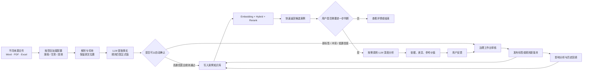
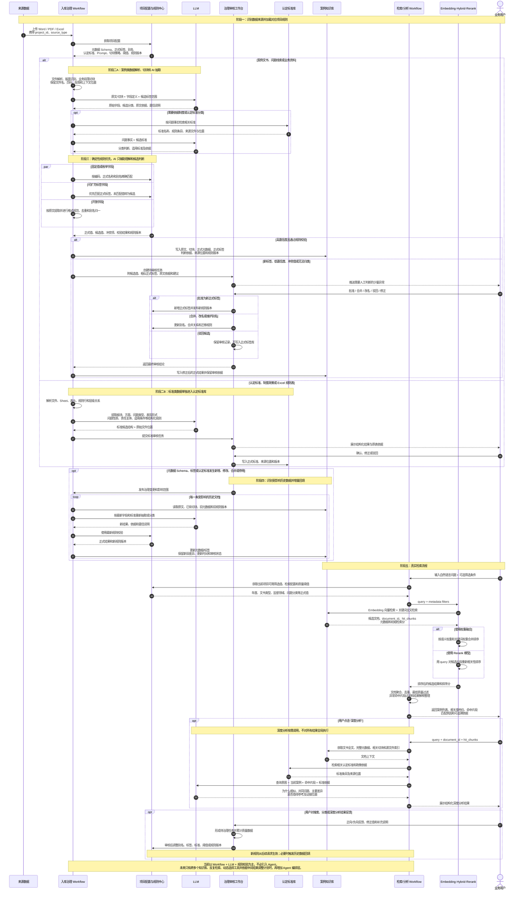
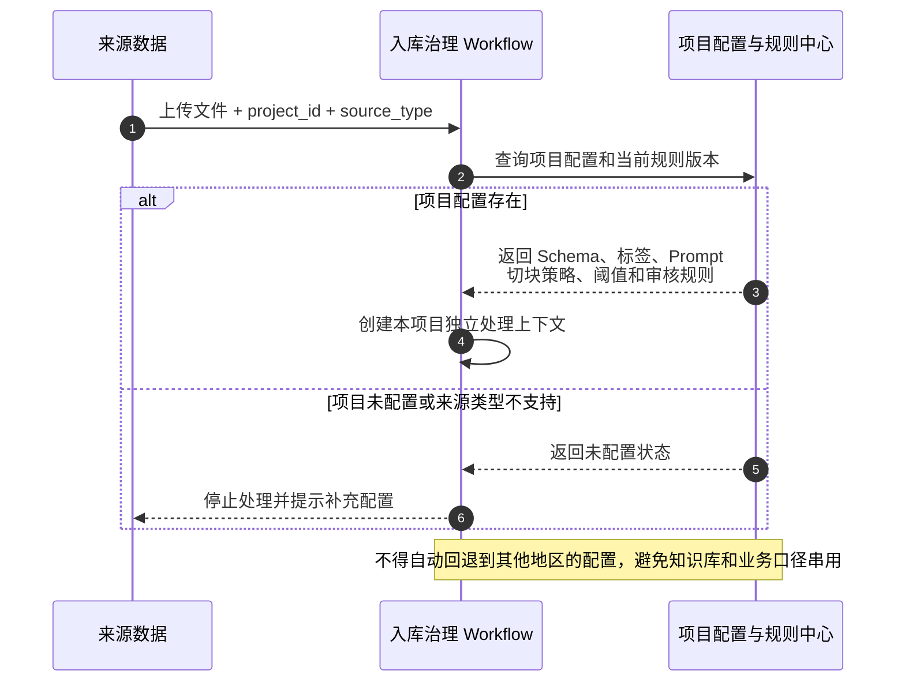
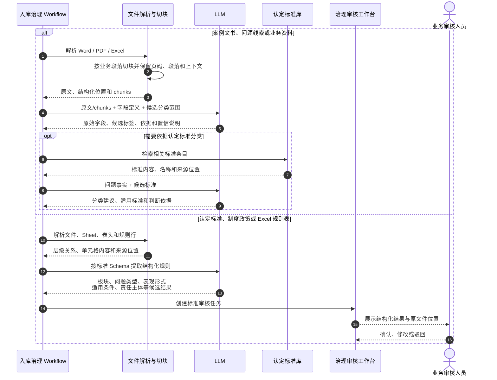
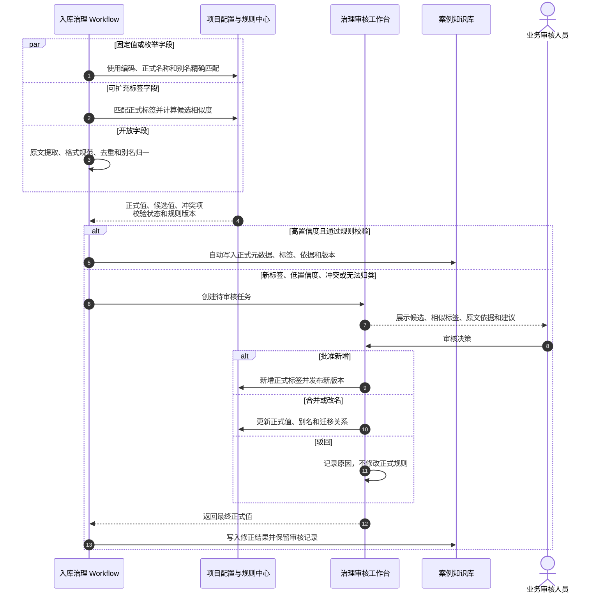
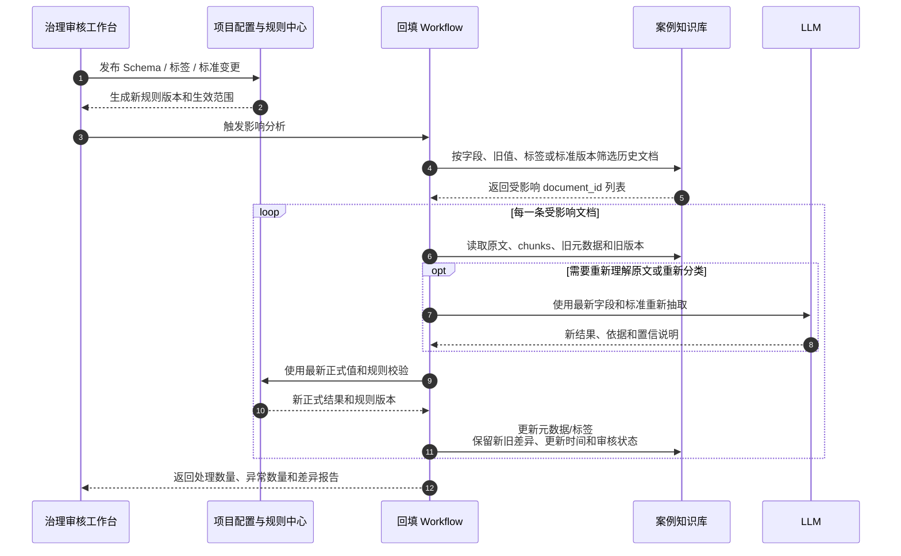
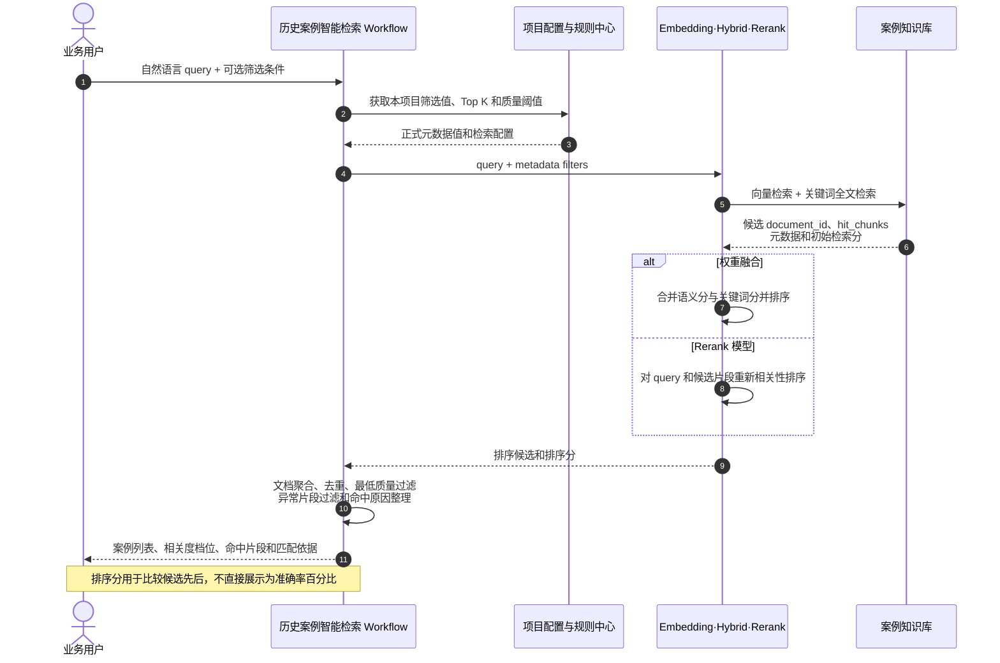
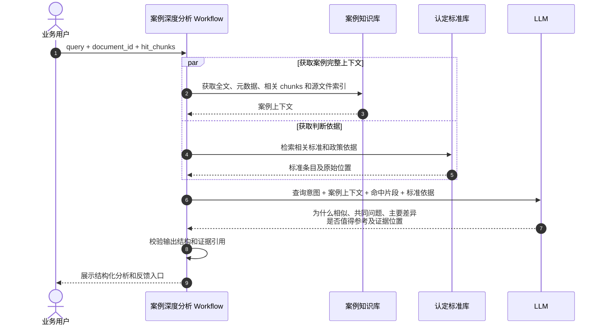
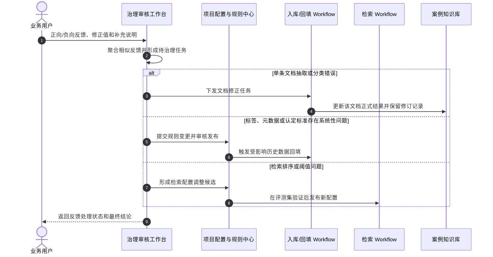

# 通用知识入库治理与智能检索整体流程说明

## 一、为什么需要这套整体框架

当前需要处理的不只是“把文件放进知识库”，而是把不同地区、不同来源、不同格式的数据，转成可检索、可分类、可解释、可持续更新的知识资产。

如果只有单次 LLM 抽取或单个入库 Workflow，会产生几个长期问题：

- 不同项目的字段、标签和分类口径容易混用。
- LLM 可能生成同义、近义或不稳定的新标签。
- 元数据或认定标准调整后，历史数据无法自动补充和迁移。
- 检索只能返回“相似结果”，难以解释为什么命中、依据是什么。
- 所有异常都依赖人工逐条处理，会增加用户工作量。

因此，整体方案需要同时覆盖四件事：

1. 新数据标准化入库。
2. 元数据、标签和认定标准治理。
3. 存量数据回填与版本迁移。
4. 智能检索、可选深度分析和用户反馈回流。

## 二、总体设计思路

整体采用“通用引擎 + 项目配置”的方式：

- 通用引擎负责文件解析、切块、LLM 调用、规则校验、审核分流、知识库写入、检索和回填。
- 项目配置负责定义湖南、甘肃等不同项目各自的元数据 Schema、正式标签、认定标准、Prompt、切块策略、阈值和审核规则。
- Workflow 负责编排稳定流程；LLM 负责理解非结构化内容；确定性规则负责正式值、格式、别名和版本校验。
- 正常且高置信度的数据自动处理；只有新标签、低置信度、冲突值和规则升级差异进入人工审核。

### 2.1 一张图看懂这套方案

这不是一个“让 LLM 自动决定一切”的系统，而是一条可控制的知识生产线：

- 配置决定每个项目使用什么字段、标签、Prompt、切块方式和审核阈值。
- Workflow 按固定步骤执行文件处理、异常分流、检索和回填。
- LLM 只处理需要理解语义的环节，并必须返回原文依据。
- 治理人员只处理少量异常，不逐条审核所有正常数据。
- 当前正式结果进入知识库；候选值、审核记录和版本历史保存在治理数据中。

### 2.2 什么人使用什么功能

| 使用角色 | 主要目标 | 直接使用的功能 | 不需要接触的内容 |
|---|---|---|---|
| 业务使用人员 | 快速找到可参考案例并判断是否有用 | 案例检索、筛选、详情、按需深度分析、结果反馈 | Workflow 节点、模型参数、标签版本 |
| 业务专家 / 治理审核人员 | 维护业务口径并处理系统无法自动确认的少量异常 | 候选标签审核、冲突值修正、标准确认、反馈处理 | API Key、知识库接口、部署参数 |
| 知识库管理员 | 保证字段、标签、版本和历史数据一致 | 元数据定义、标签目录、规则发布、影响分析、回填任务 | 逐条业务检索过程 |
| 项目实施 / 技术管理员 | 配置不同项目的处理能力并保障运行 | 项目配置、Prompt、Dify Workflow、接口、日志、阈值和评测集 | 代替业务专家决定正式业务口径 |

### 2.3 按阶段理解：谁做什么、最后得到什么

| 阶段 | 业务人员看到什么 | 系统在后台做什么 | 主要产出 |
|---|---|---|---|
| 1. 项目初始化 | 确认湖南项目使用的字段、标签和业务口径 | 建立独立 `project_id`，装载 Schema、Prompt、切块、阈值和 Workflow 配置 | 湖南项目配置基线 |
| 2. 文件入库 | 上传文件并查看处理状态 | 解析文件、切块、LLM 抽取事实、保留原文位置 | 原始字段、候选分类和依据 |
| 3. 标准化治理 | 只处理待审核异常 | 正式值匹配、别名归一、冲突检查和置信分流 | 当前有效元数据、正式标签或治理任务 |
| 4. 规则发布与回填 | 查看变更影响并决定是否执行 | 生成新版本、筛选受影响文档、增量重跑 | 新旧差异、回填结果和版本记录 |
| 5. 智能检索 | 输入问题、筛选并查看候选案例 | Embedding、全文检索、融合/Rerank、文档聚合 | 候选案例、命中片段和排序依据 |
| 6. 深度分析 | 点击单条案例进一步判断 | 获取全文、命中片段和认定标准，按需调用 LLM | 相似原因、差异、参考价值和证据 |
| 7. 反馈优化 | 对错误结果修正或评价 | 聚合相似反馈，形成文档修正、规则调整或检索评测任务 | 可审核的优化建议和持续改进数据 |

每个阶段都应先输出结构化结果，再决定是否进入下一阶段。这样某个 LLM、知识库或 Workflow 将来替换时，不会破坏整条业务链。

### 2.4 配置化与代码化的边界

MVP 优先通过配置实现，但不能让页面和数据结构直接绑定 Dify。推荐边界如下：

| 层级 | MVP 主要实现方式 | 后续生产化方式 | 稳定边界 |
|---|---|---|---|
| 页面 | 项目现有 React 原型与管理页面 | 继续复用或迁移到正式前端 | 页面只调用统一业务 API |
| 接口层 | 项目 BFF 统一封装 Dify 和知识库接口 | 正式后端服务 | 请求和响应结构保持稳定 |
| 流程编排 | Dify Workflow 配置节点、分支和 LLM 调用 | 可逐步改为代码工作流或任务服务 | Workflow 输入输出协议不变 |
| 规则与配置 | 项目配置文件或轻量治理库 | 数据库中的配置中心、版本中心 | 使用 `project_id + config_version` 隔离 |
| 文档知识 | Dify 知识库存原文、切块和当前有效元数据 | 可替换为正式检索引擎与对象存储 | `document_id`、chunk、元数据字段保持可迁移 |
| 候选与审核 | 轻量治理数据表 | 正式治理数据库和审计日志 | 不把候选值直接写成正式知识库元数据 |

因此，Dify 在 MVP 中是“可配置的执行器”，不是产品唯一底座。未来把 Dify 节点替换为代码服务时，页面、业务概念和治理数据不需要重做。

## 三、从来源数据到检索反馈的完整时序图

## 四、分阶段时序图

### 阶段一：来源识别与项目配置路由

本阶段先确定数据属于哪个项目和哪种来源，再加载该项目自己的元数据、标签、Prompt 和处理规则。湖南、甘肃等项目之间不共用业务规则，只复用处理引擎。

### 阶段二：文件解析、切块与 AI 抽取

本阶段根据来源类型分为“案例类数据”和“标准类数据”。两类数据使用不同的解析与入库路径。

### 阶段三：元数据标准化、标签匹配与审核分流

本阶段决定哪些结果可以自动成为正式数据，哪些结果必须进入候选池和人工审核。

### 阶段四：规则变更与历史数据回填

本阶段处理元数据字段新增、标签修改、认定标准升级以及旧值更新，不要求人工逐条修改历史文档。

### 阶段五：智能检索、排序与结果解释

本阶段执行第一层快速检索。Embedding、全文检索和 Rerank 只负责召回与排序，不直接生成深度分析结论。

### 阶段六：按需深度分析

深度分析只在用户点击某一条结果后调用，避免对全部候选案例调用 LLM，控制响应时间和模型成本。

### 阶段七：用户反馈与持续优化

用户反馈先进入治理队列，不能未经审核直接修改正式标签、阈值或全局规则。

## 五、图中几个关键分支

### 1. 两类来源数据分开处理

- 案例文书、问题线索和业务资料进入案例知识库。
- 认定标准、制度政策和 Excel 规则表进入认定标准库。
- 两类数据可以互相引用，但不能混成同一种知识对象。

### 2. 三类元数据值采用不同处理方式

- 固定值或枚举字段：使用编码、正式名称、别名进行确定性匹配，例如行政区划。
- 可扩充标签字段：先匹配正式标签；匹配失败时进入候选池，经审核后才能成为正式标签，例如违规类型。
- 开放字段：按原文抽取和格式规范，不要求提前枚举所有值，例如标题、文号、单位名称和日期。

### 3. LLM 不能直接修改正式规则

LLM 负责抽取、理解、候选分类和依据整理。正式标签新增、标签合并、规则修改和标准发布必须经过规则校验或人工审核，避免模型结果直接污染正式数据。

### 4. 历史数据回填属于治理流程

当新增元数据字段、调整标签、更新认定标准或修改规则版本时，系统识别受影响文档并批量重跑，只更新受影响数据，同时保留新旧结果差异和规则版本。

### 5. 搜索和深度分析分两层

- 第一层检索使用 Embedding、全文检索、权重融合或 Rerank，快速返回候选案例。
- 第二层深度分析只在用户点击后调用 LLM，结合 `query`、`document_id`、`hit_chunks`、全文和认定标准生成分析。
- `hit_chunks` 是首次检索实际命中的文档片段，用于解释命中原因、定位原文并缩小深度分析上下文。

Dify 官方模型接口说明中，Rerank 用于在初始检索之后，根据查询与候选文档的相关性重新排序；它产生的是排序相关性分，不应直接解释为准确率概率：[Dify Rerank 官方说明](https://docs.dify.ai/zh/develop-plugin/features-and-specs/plugin-types/model-schema)。

## 六、建议拆分的 Workflow

| Workflow | 主要职责 | 是否调用 LLM |
|---|---|---|
| 通用入库治理 Workflow | 项目路由、解析切块、元数据抽取、规则校验、异常分流、知识库写入 | 是 |
| 元数据与标签治理 Workflow | 候选审核、标签合并、规则发布、影响范围识别、存量回填 | 按需 |
| 历史案例智能检索 Workflow | Embedding、Hybrid、Rerank、筛选、阈值过滤和结果整理 | 通常不需要生成式 LLM |
| 案例深度分析 Workflow | 按用户点击调用，解释相似性、共同问题、差异和参考价值 | 是 |

## 七、当前阶段与后续扩展边界

当前阶段先完成 Workflow、LLM、规则中心、治理工作台和知识库之间的稳定闭环，不需要为了“智能化”提前引入 Agent。

后续出现以下任务时，再考虑在现有 Workflow 上增加 Agent：

- 同一个问题需要跨多个知识库反复检索。
- 需要根据中间结果决定下一步调用哪个工具。
- 需要自动调整检索词、扩大或缩小范围并多轮验证。
- 需要综合案例、制度、指标和外部数据形成研究报告。

Agent 应作为上层动态编排能力，复用现有入库、检索、深度分析和治理 Workflow，而不是替代这些稳定流程。
